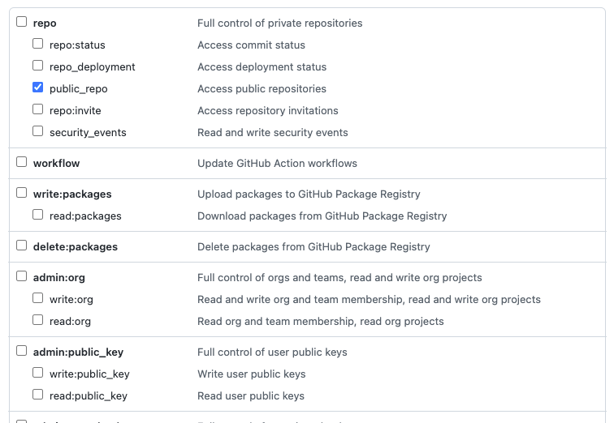
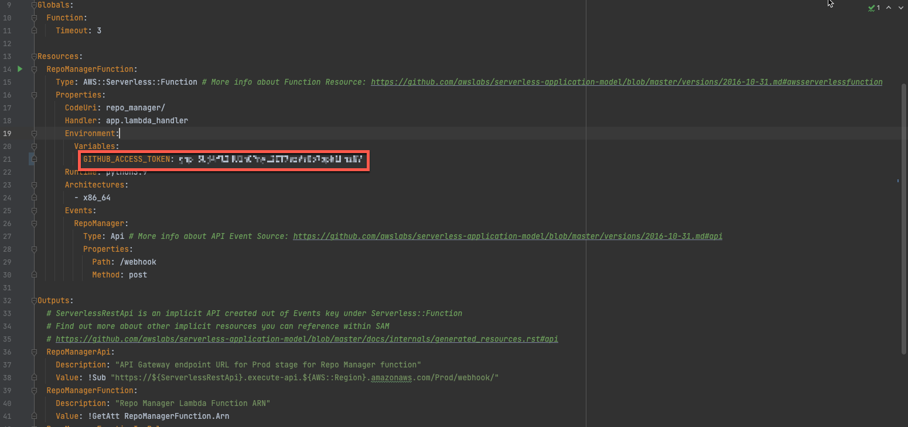
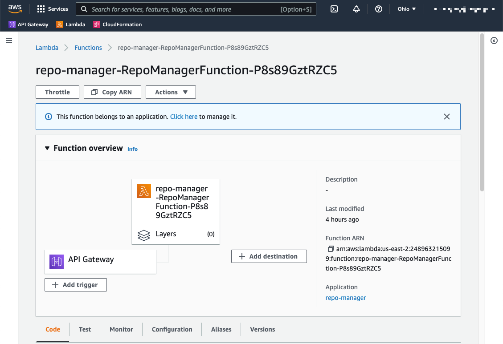

# GitHub Repository Manager

This project demonstrates how to automatically enable branch protection in every new repository created in a [GitHub Organization](https://docs.github.com/en/organizations/collaborating-with-groups-in-organizations/about-organizations).

This is accomplished by using organization [webhooks](https://docs.github.com/en/rest/reference/orgs#webhooks) to send an HTTP POST payload to a third-party service that uses the GitHub [REST API](https://docs.github.com/en/rest) to programmatically enable protection on the default branch of the newly created repository.

The third-party service is implemented in python as a serverless [AWS Lambda](https://aws.amazon.com/lambda/) function.

:bulb: The third-party service can be implemented in any programming language and deployed to any platform as long it is able to receive events sent by the Organization webhook. You can even use [ngrok](https://ngrok.com/) or similar solutions to expose the service directly from an http server running in localhost.

GitHub provides the [Octokit library](https://docs.github.com/en/rest/overview/libraries) in Ruby, .Net and Javascript. [Third-party libraries](https://docs.github.com/en/rest/overview/libraries#third-party-libraries) are also available to support other languages.

This project uses the [PyGitHub](https://github.com/PyGithub/PyGithub) library to manage GitHub resources.

## Getting Started

These instructions will guide you on building and deploying the AWS Lambda function and configuring the GitHub organization webhook.

### Prerequisites
- [GitHub](https://docs.github.com/en/get-started/signing-up-for-github/signing-up-for-a-new-github-account) personal account
- [AWS Free Tier](https://aws.amazon.com/free/) account
- [AWS CLI](https://aws.amazon.com/cli/)
- [AWS SAM CLI](https://docs.aws.amazon.com/serverless-application-model/latest/developerguide/serverless-sam-cli-install.html)
- [Python 3](https://www.python.org/downloads/)
- [Docker](https://hub.docker.com/search/?type=edition&offering=community) - For testing the AWS Lambda function locally

### GitHub Personal Access Token
To enable communication between the serverless function and the GitHub API you will need to generate a GitHub personal access token.

Please follow the [documentation](https://docs.github.com/en/authentication/keeping-your-account-and-data-secure/creating-a-personal-access-token) to create one.

For this example, only the **public_repo** scope is needed.



:warning: Save the personal access token in a safe place, it will be used later in this guide.

See GitHub's documentation to learn more about [scopes](https://docs.github.com/en/developers/apps/building-oauth-apps/scopes-for-oauth-apps#available-scopes).
### AWS Lambda

#### Setup
- [Configure the AWS CLI](https://docs.aws.amazon.com/cli/latest/userguide/cli-configure-quickstart.html) and login to your account
- Clone this repository and switch to the location where the repository was cloned

	```bash
	git clone https://github.com/org-acme/repo-manager.git
	```
- Open the file named [template.yaml](template.yaml) in an editor and fill the environment variable named `GITHUB_ACCESS_TOKEN` with the token generated previously
	
	:warning: Don't commit and push this file to your repository!
	
	
	
	This file is a [AWS CloudFormation template](https://docs.aws.amazon.com/AWSCloudFormation/latest/UserGuide/aws-resource-lambda-function.html) used to create resources in AWS.

- Save the changes to the template file

#### Building the project

- Open a terminal and navigate to the location where you cloned this project
- Run the following [AWS SAM CLI command](https://docs.aws.amazon.com/serverless-application-model/latest/developerguide/sam-cli-command-reference-sam-build.html) to build the application

	```bash
	sam build
	```
	This command will create some resources in your AWS account to prepare the environment for deployment. For more information, please review the [AWS SAM CLI documentation.](https://docs.aws.amazon.com/serverless-application-model/latest/developerguide/serverless-sam-cli-command-reference.html)

### Deploying the project

- In the same terminal window used in the previous step, run the following command

	```bash
	sam deploy --guided
	```
	This command will use the CloudFormation template from the file [template.yaml](template.yaml) to create the resources for the AWS Lambda function in your AWS account.
	
- After running the command you will be prompted for some information, you can use the defaults or you can use your own values if needed.

	```sh
	Setting default arguments for 'sam deploy'
		=========================================
		Stack Name [repo-manager]:
		AWS Region [us-east-2]:
		#Shows you resources changes to be deployed and require a 'Y' to initiate deploy
		Confirm changes before deploy [Y/n]:
		#SAM needs permission to be able to create roles to connect to the resources in your template
		Allow SAM CLI IAM role creation [Y/n]:
		#Preserves the state of previously provisioned resources when an operation fails
		Disable rollback [y/N]:
		RepoManagerFunction may not have authorization defined, Is this okay? [y/N]: y
		Save arguments to configuration file [Y/n]:
		SAM configuration file [samconfig.toml]:
		SAM configuration environment [default]:
	```
- After a few seconds, you will be asked to confirm if you want to go ahead with the deployment. 
- After confirmation, will create the resources in your AWS account. This may take some time.
- Once the process is finished a summary of the changes will be displayed on your terminal, make note of the API Gateway endpoint URL, it will be used to configure the GitHub Organization webhook.
	
	```bash
	CloudFormation outputs from deployed stack
	---------------------------------------------------------------------------------------------------------------------------------------------------------------------------------------------------------------------------------------------------------------------------
	Outputs
	---------------------------------------------------------------------------------------------------------------------------------------------------------------------------------------------------------------------------------------------------------------------------
	Key                 RepoManagerFunctionIamRole
	Description         Implicit IAM Role created for Repo Manager function
	Value               arn:aws:iam::248963215099:role/repo-manager-RepoManagerFunctionRole-7VCRYYA197XM
	
	Key                 RepoManagerFunction
	Description         Repo Manager Lambda Function ARN
	Value               arn:aws:lambda:us-east-2:248963215099:function:repo-manager-RepoManagerFunction-P8s89GztRZC5
	
	Key                 RepoManagerApi
	Description         API Gateway endpoint URL for Prod stage for Repo Manager function
	Value               https://726t9vtafb.execute-api.us-east-2.amazonaws.com/Prod/webhook/
	---------------------------------------------------------------------------------------------------------------------------------------------------------------------------------------------------------------------------------------------------------------------------
	
	Successfully created/updated stack - repo-manager in us-east-2
	```
- To validate that the deployment was successful, open your browser and navigate to the AWS Console  and go to Lambda > Functions


	
	
### GitHub

Once the application has been deployed, we are ready to configure our GitHub organization webhooks to notify the application when a new repository has been created.


### Testing

Add additional notes about how to deploy this on a live system


## Contributing

Please feel free to raise issues or submit pull requests to improve this project.

## Authors

* **Jose Mayorga** - *Initial work*

See also the list of [contributors](https://github.com/org-acme/repo-manager/contributors) who participated in this project.

## License

See the [LICENSE.md](LICENSE.md) file for details

## Acknowledgments

* [README](https://gist.github.com/PurpleBooth/109311bb0361f32d87a2) Template
* [PyGithub](https://pygithub.readthedocs.io/en/latest/introduction.html)
*
